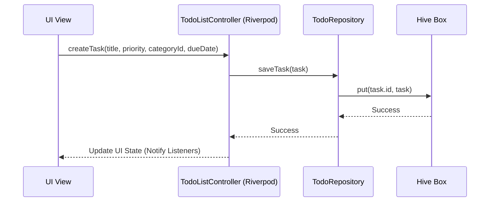

# Solution Overview: Flutter Todo App

This document details how the selected technical architecture implements and solves the requirements defined for the offline-first Todo application.

---

## 1. Key Workflows & User Flows

The application's core logic is organized into clean workflows executing on the local client (Mobile/Web).

### 1.1 Task Creation & Category Association
1. **User Action**: The user taps the "+" button, opening a bottom sheet or dialog to create a task.
2. **Category Selection**: The user selects a category (optional). If none exists or a new one is needed, they can quick-create a category with a selected color.
3. **Data Generation**:
   - The UI generates a UUID using the `uuid` package.
   - A `Task` model is instantiated with the user-provided title, description, category ID, priority, and due date.
4. **Persistence**: The model is saved to the Hive box `tasks_box` using `tasksBox.put(task.id, task)`.
5. **State Update**: Riverpod's `TodoListController` automatically detects the box update (via Hive stream or explicit notifier modification) and refreshes the UI.

### 1.2 Scheduling Reminders
1. When a task is created or updated with a `dueDate` and time, the UI calls `NotificationController.schedule(task)`.
2. The `NotificationController` invokes the `NotificationService`.
3. For **Mobile**: `flutter_local_notifications` schedules an exact alarm based on the task's due date/time.
4. For **Web**: The due date is saved. Upon app launch or if the app is active, timers are set in memory, or fall back to browser Notification requests.
5. If a task is completed, deleted, or rescheduled, any existing scheduled notification for its ID is canceled via `cancel(task.id)`.

### 1.3 Trash, Archive, and Deletion
- **Archive**: Sets the `isArchived` flag to `true`. The main todo list filters out archived tasks. Archived tasks are viewable in the Archive folder.
- **Trash (Soft Delete)**: Sets the `isDeleted` flag to `true`. This hides the task from both the active list and archives. The task is visible in the Trash folder.
- **Restore**: Sets `isDeleted` back to `false`.
- **Permanent Delete**: Calls `tasksBox.delete(task.id)`, removing it forever.

---

## 2. Responsive UI Design

Since the app targets Android, iOS, and Web, the interface adapts dynamically to screen sizes:

### 2.1 Mobile View (Portrait)
- **Navigation**: Bottom Navigation Bar (Todo, Categories, Archive/Settings).
- **List View**: Single column list with swipe gestures (Swipe left to archive/delete, Swipe right to toggle completion status).
- **Task Creation**: Compact Bottom Sheet popping up from the bottom.

### 2.2 Desktop/Web View (Widescreen)
- **Navigation**: Permanent Left Navigation Drawer.
- **Split Screen Layout**:
  - Left Panel: List of tasks with search and filters pinned at the top.
  - Right Panel: Detailed view of the selected task, showing its checklist/subtasks, priority details, notes, and activity timeline.
- **Task Creation**: Dedicated dialog popup or right-hand pane editor.

---

## 3. Storage Layer Details (Hive integration)

Hive manages data synchronously in memory while scheduling asynchronous disk writes, ensuring UI interactions are immediate.

- **Initialization Flow**:
  1. `Hive.initFlutter()` initializes browser IndexedDB (web) or path-based storage (mobile).
  2. Register Type Adapters: `Hive.registerAdapter(TaskAdapter())`, etc.
  3. Open boxes: `await Hive.openBox<Task>('tasks')`, `await Hive.openBox<Category>('categories')`.
  4. Inject boxes into data source classes.
- **Offline Data Sync**: As the app is offline-first, no background synchronization with cloud storage is scheduled. Data persistence is guaranteed on app termination because Hive flushes mutations instantly.

---

## 4. Edge Cases & Error Handling

| Edge Case | Risk Level | Mitigation Strategy |
| :--- | :--- | :--- |
| **Notification Permission Denied** | Low | The app will check notification permissions on launch. If denied, it displays an optional visual warning when a user tries to schedule a reminder, pointing them to settings. |
| **Browser Storage Eviction (Web)** | Medium | Browsers can evict IndexedDB if storage is full. The app will utilize the `navigator.storage.persist()` API in modern browsers to request persistent storage. |
| **Database Model Migration** | Medium | Hive uses incremental Type IDs. If we change fields, new fields will be marked with a new `@HiveField(index)` and declared as nullable/optional to maintain backward compatibility. |
| **Concurrent UI Operations** | Low | Riverpod acts as the single source of truth. Any database updates flow unidirectionally through Riverpod to prevent UI race conditions. |
