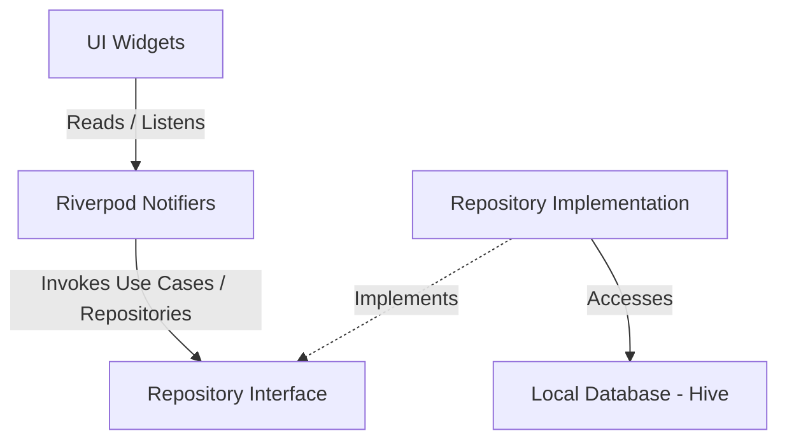

# Technical Architecture: Flutter Todo App

This document outlines the technical design, architectural patterns, stack components, and directories structure for the offline-first Flutter Todo App.

---

## 1. Core Technology Stack

| Category | Technology / Library | Description |
| :--- | :--- | :--- |
| **Framework** | **Flutter (Dart)** | Cross-platform UI toolkit targeting iOS, Android, and Web. |
| **State Management** | **Riverpod + Riverpod Generator** | Compile-safe state management for dependency injection, caching, and UI state tracking. |
| **Local Storage** | **Hive & Hive Flutter** | High-performance, lightweight NoSQL key-value database written in pure Dart, ensuring seamless cross-platform support (mobile & web) without native database overhead. |
| **Notifications** | **flutter_local_notifications** | Handles scheduling local push notifications on Android & iOS. |
| **Model Equality** | **Equatable** | Simplifies value equality checks in Dart models. |
| **ID Generation** | **UUID** | Generates unique, secure IDs locally for tasks and categories. |

---

## 2. Architectural Pattern (Feature-First Clean Architecture)

The project will follow a **Feature-First Clean Architecture** approach. This structure organizes code by feature slices (e.g., `todo`, `category`, `settings`) rather than technical layers at the root level, making it easier to scale and maintain.

Each feature slice contains three layers:
1. **Data Layer**: Handles raw data operations (local database access, entity-to-model mapping).
2. **Domain Layer**: Contains core business logic, entities, and repository interfaces.
3. **Presentation Layer**: Houses UI widgets and Riverpod state controllers.



### Folder Directory Structure

```text
lib/
├── main.dart
├── app.dart
├── core/
│   ├── theme/               # Application styling (Light / Dark mode)
│   ├── services/            # Global services (e.g., NotificationService)
│   └── utils/               # Helpers, formatting, and extensions
├── features/
│   ├── todo/
│   │   ├── data/
│   │   │   ├── models/      # Hive-annotated models (serialization)
│   │   │   └── datasources/ # Hive Box access methods
│   │   ├── domain/
│   │   │   ├── entities/    # Pure Dart task objects
│   │   │   └── repositories/# Abstract repository interface
│   │   └── presentation/
│   │       ├── controllers/ # Riverpod State Notifiers
│   │       └── widgets/     # UI components (Task list, Task card, sheet)
│   └── category/
│       ├── data/
│       ├── domain/
│       └── presentation/
```

---

## 3. Data Storage & Schema Design

Hive stores data in **Boxes** (equivalent to tables in SQL). Since we need to support web platforms smoothly, Hive is selected due to its lightweight Web IndexedDB storage fallback.

### 3.1 Task Schema (Hive Type ID: 0)

| Field Name | Type | Description |
| :--- | :--- | :--- |
| `id` | `String` (UUID) | Unique identifier (Primary Key) |
| `title` | `String` | Title of the task |
| `description` | `String` | Optional detail description |
| `isCompleted` | `bool` | Current completion status |
| `priority` | `String` | enum mapping (`low`, `medium`, `high`) |
| `dueDate` | `DateTime?` | Optional target deadline |
| `categoryId` | `String?` | Foreign key referencing a custom category |
| `subtasks` | `List<Subtask>` | Inline list of sub-items/checklists |
| `isArchived` | `bool` | Archived status |
| `isDeleted` | `bool` | Soft delete/Trash flag |
| `createdAt` | `DateTime` | Creation timestamp |

### 3.2 Subtask Schema (Hive Type ID: 1)

| Field Name | Type | Description |
| :--- | :--- | :--- |
| `id` | `String` (UUID) | Unique identifier |
| `title` | `String` | Subtask checkbox title |
| `isCompleted` | `bool` | Status |

### 3.3 Category Schema (Hive Type ID: 2)

| Field Name | Type | Description |
| :--- | :--- | :--- |
| `id` | `String` (UUID) | Unique identifier |
| `name` | `String` | Category label (e.g., Work, Shopping) |
| `colorHex` | `String` | Display color representation (ARGB Hex string) |
| `iconCodePoint` | `int?` | Icon visual representation identifier |

---

## 4. State Management Design (Riverpod)

State will be split into isolated controllers following the Single Responsibility Principle:

1. **`TodoListController`**:
   - Manages list of active, archived, and trashed tasks.
   - Exposes methods for additions, updates, soft-deletes, and filtering/sorting.
2. **`CategoryListController`**:
   - Manages user-defined categories.
3. **`NotificationController`**:
   - Interfaces with platform-level notification helpers to schedule/cancel reminders based on tasks.

---

## 5. Cross-Platform Adaptability

### 5.1 Storage Adaptability
- **Mobile (Android/iOS)**: Hive stores binaries locally inside the app documents directory via `path_provider`.
- **Web**: Hive automatically routes operations to IndexedDB inside the web browser without any performance loss.

### 5.2 Notification Adaptability
- We will define a generic `NotificationService` interface:
```dart
abstract class NotificationService {
  Future<void> initialize();
  Future<void> scheduleNotification(String id, String title, String body, DateTime scheduledTime);
  Future<void> cancelNotification(String id);
}
```
- **Mobile Implementation**: Implements scheduling using `flutter_local_notifications` targeting Android alarm channels and iOS permissions.
- **Web Implementation**: Falls back to the standard HTML5 Notifications API or logs actions gracefully if permissions are denied.
